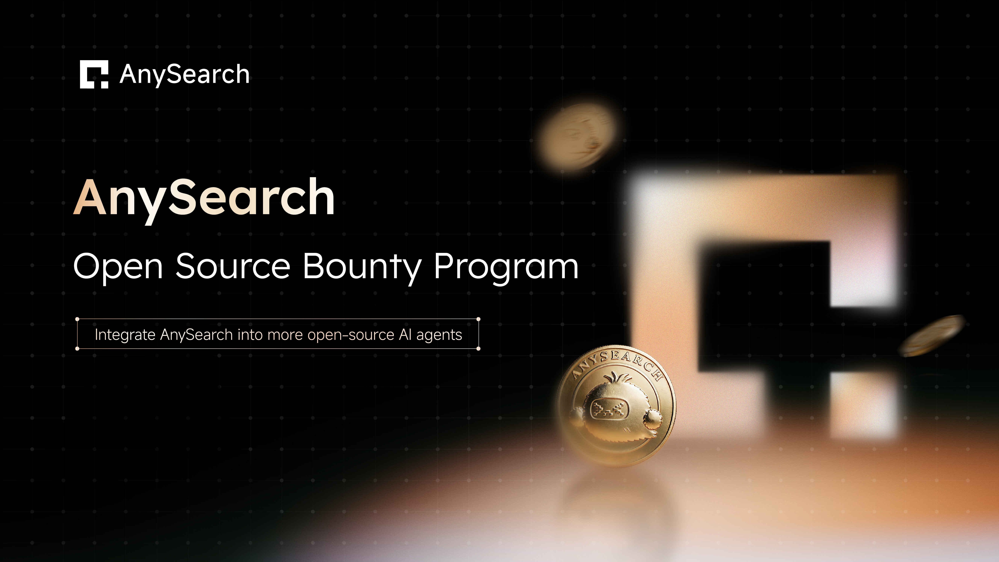

# AnySearch Open Source Bounty Program

A **CNY 100,000** prize pool for developers who integrate AnySearch into major open-source AI Agent projects.

[English](README.md) | [中文](README.zh.md)

[Register](https://forms.gle/i3azg6dATzCvYeED6) · [View Projects](./bounty-projects.md) · [Detailed Rules](./docs/rules.md)

---

## Overview

[AnySearch](https://github.com/anysearch-ai) is the search infrastructure for AI agents, supporting general web search, vertical domain search, and parallel batch search. This round of the Open Source Bounty Program offers a **CNY 100,000** prize pool, available until exhausted.

We value high-quality, practical integrations. Participants must follow the target project's requirements, and a successful final merge is the primary basis for awarding a bounty. AnySearch hopes to work with developers to bring accurate, reliable search to more agents.

---

## How It Works

<table>
  <thead>
    <tr>
      <th width="80">Step</th>
      <th width="180">Action</th>
      <th>Details</th>
    </tr>
  </thead>
  <tbody>
    <tr>
      <td align="center"><strong>1</strong></td>
      <td nowrap><strong>Register</strong></td>
      <td>Submit the <a href="https://forms.gle/i3azg6dATzCvYeED6">Registration Form</a> and select your target project.</td>
    </tr>
    <tr>
      <td align="center"><strong>2</strong></td>
      <td nowrap><strong>Get a Claim ID</strong></td>
      <td>Approved registrations receive a unique Claim ID by email, which locks the task to you.</td>
    </tr>
    <tr>
      <td align="center"><strong>3</strong></td>
      <td nowrap><strong>Submit a PR</strong></td>
      <td>Within 7 calendar days of receiving your Claim ID, open a pull request against the target repository and email the link to AnySearch.</td>
    </tr>
    <tr>
      <td align="center"><strong>4</strong></td>
      <td nowrap><strong>Merge and claim</strong></td>
      <td>Once your PR is merged, submit proof of the merge by email to claim your bounty.</td>
    </tr>
  </tbody>
</table>

Registration deadline: **2026-10-31 23:59 UTC+8**. Bounty amounts are published per project in the [Bounty Project List](./bounty-projects.md).

  
  
  
  
  
  
  
  
  
  
  
  
  
  
  

  
  
  
  
  
  
  
  
  
  
  
  
  
  
  

---

## What Qualifies

A qualifying integration must:

- Use a built-in API, MCP, Skill, or another integration method. Built-in means the code is merged into the main repository, distributed with the release package, or listed as a default integration in the project's official documentation.
- Integrate as much of the AnySearch capability set as the project's framework allows:
  - General search, including anonymous search and parallel search
  - Vertical domain search
  - Extract for web page parsing
- Ship with a development document in Markdown (.md) format to support future maintenance.

> **Core requirement:** Users must be able to actually use AnySearch by following the project's official documentation.

Only projects on the official [Bounty Project List](./bounty-projects.md) are eligible for this round. Developers may recommend other open-source AI Agent projects through the registration form. AnySearch reviews those nominations, and qualifying projects may be added to a future program.

See [Detailed Rules](./docs/rules.md) for the complete requirements.

If you have any questions, please contact mkt@anysearch.com

---

## Important Notes

- **Register first.** The official form is the only valid registration channel, and a PR submitted without a valid Claim ID is not eligible for a bounty.
- **One active Claim ID per repository.** If multiple developers choose the same project, they queue in registration order, and the next developer takes over when the current claim expires.
- **Payment follows review.** Once the merge is verified and payment information is confirmed, payment is normally initiated within 14 business days. Bounties are pre-tax, and each individual can receive up to 3 bounty payments during the program.

---

## Resources

- [Detailed Rules](./docs/rules.md)
- [FAQ](./docs/faq.md)
- [Bounty Project List](./bounty-projects.md)
- [AnySearch on GitHub](https://github.com/anysearch-ai)

---

## License

This project is licensed under the Apache License 2.0. See the [LICENSE](LICENSE) file for details.
