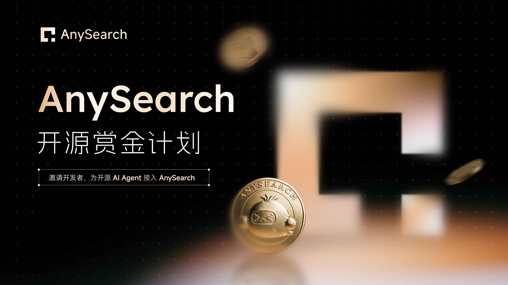
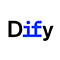
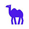

# AnySearch 开源赏金计划

**人民币 10 万元奖金池**，面向将 AnySearch 接入主流开源 AI Agent 项目的开发者。

[English](README.md) | [中文](README.zh.md)

[立即报名](https://forms.gle/i3azg6dATzCvYeED6) · [查看项目](./bounty-projects.md) · [详细规则](./docs/rules.zh.md)

---

## 一、计划简介

[AnySearch](https://github.com/anysearch-ai) 是面向 AI Agent 的搜索基础设施，支持通用网页搜索、垂直领域搜索与并行批量搜索。本期开源赏金计划开放**人民币 10 万元**奖金池，发完即止。

我们更看重高质量、可实际使用的集成：参与者需按目标项目自身要求完成 AnySearch 接入，并以最终成功 Merge 作为奖金发放的主要依据。AnySearch 希望与开发者一起，让更多 Agent 获得准确、稳定的搜索能力。

---

## 二、参与流程

| 步骤 | 操作 | 说明 |
| :---: | --- | --- |
| **1** | **报名** | 通过[报名表单](https://forms.gle/i3azg6dATzCvYeED6)提交申请，并选定目标项目。 |
| **2** | **获取认领编号** | 审核通过的报名将收到邮件发送的唯一认领编号，对应任务随即锁定。 |
| **3** | **提交 PR** | 获得认领编号后 7 个自然日内，向目标仓库提交有效 PR，并将链接邮件反馈给 AnySearch。 |
| **4** | **合入并申请奖金** | PR 成功合入后，通过邮件提交合入证明材料，申请奖金。 |

报名截止：**2026-10-31 23:59 UTC+8**。各项目奖金金额以[赏金项目清单](./bounty-projects.md)公布为准。

  
  
  
  
  
  
  
  
  
  
  
  
  
  
  

  
  
  
  
  
  
  
  
  
  
  
  
  
  
  

---

## 三、合格集成的标准

合格集成需满足以下条件：

- 采用内置 API、MCP、Skill 或其他方式接入。内置的定义：代码合入主仓库、随发布包分发，或被项目官方文档列为默认集成。
- 在项目框架允许的范围内，尽可能完整地集成 AnySearch 的搜索能力：
  - 通用搜索（含匿名搜索、并行搜索）
  - 垂直领域搜索
  - Extract 网页解析
- 提交一份 Markdown（.md）格式的开发文档，便于后续维护。

> **核心要求：** 用户能够按照项目官方文档，真实调用 AnySearch。

本期可获得奖励的项目以官方[赏金项目清单](./bounty-projects.md)为准。开发者也可通过报名表自荐其他开源 AI Agent 项目，AnySearch 将对自荐项目进行评估，符合条件的项目将纳入后续活动。

完整活动要求见[详细规则](./docs/rules.zh.md)。

如遇任何问题，请联系：mkt@anysearch.com

---

## 四、重要说明

- **先报名，再提交 PR。** 官方报名表单是唯一有效报名渠道，未持有有效认领编号的 PR 无法获得奖金。
- **同一仓库同时仅保留 1 个有效认领编号。** 多人报名同一项目时，按报名顺序进入候补队列，当前认领失效后由下一顺位递补。
- **奖金在审核通过后发放。** 合入真实性、集成可用性等审核通过并确认收款资料后，原则上 14 个工作日内发起付款；奖金为税前金额，本期活动期间同一自然人最多获得 3 次奖金。

---

## 五、相关链接

- [详细规则](./docs/rules.zh.md)
- [常见问题](./docs/faq.zh.md)
- [赏金项目清单](./bounty-projects.md)
- [AnySearch GitHub 主页](https://github.com/anysearch-ai)

---

## 六、许可证

本项目采用 Apache License 2.0 许可，详见 [LICENSE](LICENSE)。
